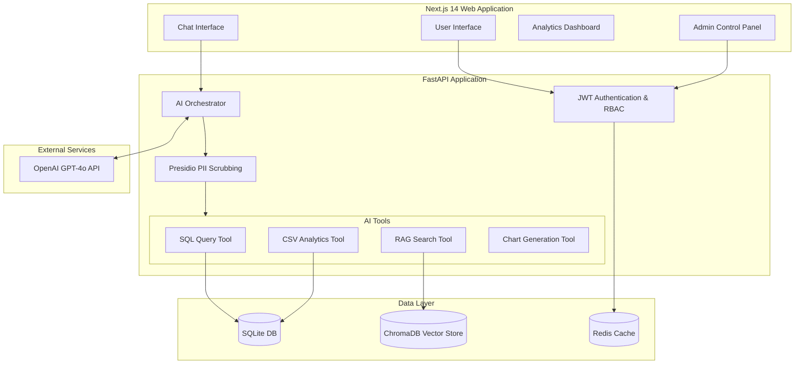
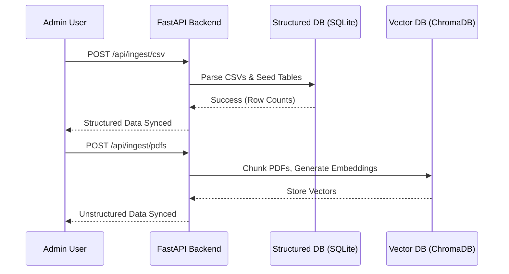

# 🛡️ Secure AI Insights Assistant

> **An enterprise-grade, secure, AI-powered analytics assistant** built to seamlessly integrate structured SQL data, unstructured PDF documents, and business metrics using Agentic AI orchestration (GPT-4o).

    

---

## 📖 Project Overview

**Secure AI Insights** is a full-stack application designed for a fictional entertainment company ("StreamCo"). It allows business analysts to converse with their data in natural language. Instead of writing complex SQL queries or manually reading through hundreds of PDF reports, analysts can simply ask the AI questions.

The system uses an **Agentic Orchestrator** pattern. The AI is equipped with tools (functions) to securely query a SQL database, read static CSV files, or perform semantic search (RAG) over vector-embedded PDF documents. It automatically selects the right tool, gathers the data, analyzes it, and generates insightful responses alongside dynamic charts.

---

## 🏗️ Architecture Diagrams

### High-Level System Architecture



### Data Ingestion Pipeline



---

## 📝 Notes on Assumptions / Tradeoffs

### Architecture Tradeoffs

| Decision | Rationale |
|---|---|
| Named SQL templates instead of LLM-generated SQL | **Security**: prevents SQL injection; the LLM picks a template, never writes SQL |
| ChromaDB local persistence | Simplicity: no extra container; production would swap for Qdrant or Weaviate |
| `all-MiniLM-L6-v2` for embeddings | CPU-compatible; no GPU required; ~80MB download |
| Pandas DataFrames in memory | CSVs are small and static; avoids duplicate DB load |
| JWT over sessions | Stateless; works across replicas without shared session store |
| Presidio PII scrubbing | Production-grade; avoids sending viewer PII to the LLM |
| Redis TTL caching | Analytics queries are expensive; 5-minute TTL keeps UI responsive |
| Tool-based architecture | LLM never touches raw data; every data access is mediated and auditable |
| OpenAI GPT-4o for Orchestration | Robust function calling and reliable structured JSON output, despite external API dependency |
| Admin-triggered Data Pipelines | Allows manual reseeding/re-embedding via UI, trading off automated cron jobs for explicit administrative control |

### Assumptions

- **SQLite** used for development portability. `DATABASE_URL` env var switches to PostgreSQL for production with zero code changes.
- **ChromaDB** runs in-process using local file persistence. Production would use Qdrant or Weaviate for horizontal scaling.
- **`all-MiniLM-L6-v2`** chosen for embedding — requires no GPU, downloads ~80MB on first run.
- **Synthetic data** seeded with `random.seed(42)` — results are deterministic and reproducible.
- **Demo users are hard-coded** — no user management UI. Production would use a proper user store with hashed passwords.
- **PDF chunking** uses fixed 400-token windows with 50-token overlap. Production would use semantic chunking.
- **Tool templates are a fixed allowlist** — deliberate security decision. The LLM cannot construct arbitrary queries.
- **No streaming** on chat — full response returned as single JSON. SSE streaming is a straightforward upgrade.
- **HTTPS** not configured at application level — assumed handled by reverse proxy in production.
- **Data volumes** — ~5,000 rows per table, ~500 ChromaDB vectors. Fits on any machine with 4GB RAM.
- **Admin Ingestion Operations** — Triggering CSV seed or PDF embeddings via the Admin Panel is resource-intensive and assumes safe usage by authorized personnel.
- **Docker Compose Setup** — Designed for single-node local development. Production deployments would split frontend (e.g., Vercel) and backend (e.g., Cloud Run / ECS).

---

## ⚙️ How to Setup and Run Locally

The entire stack is completely containerized using Docker Compose for a seamless "one-command" setup.

### Prerequisites
- Docker & Docker Compose installed
- An active OpenAI API Key

### Step-by-Step Installation

1. **Clone the Repository**
   ```bash
   git clone https://github.com/AnishGrandhe29/SecureAI.git
   cd SecureAI
   ```

2. **Configure Environment Variables**
   Copy the example `.env` file:
   ```bash
   cp .env.example .env
   ```
   Open `.env` and configure your keys:
   ```env
   OPENAI_API_KEY=sk-your-openai-api-key-here
   SECRET_KEY=your-random-jwt-secret-string
   ENVIRONMENT=development
   ```

3. **Start the Infrastructure**
   Build and start the application in detached mode:
   ```bash
   docker compose up --build -d
   ```

4. **Access the Application**
   - **Frontend UI:** [http://localhost:3000](http://localhost:3000)
   - **Backend API Docs:** [http://localhost:8000/docs](http://localhost:8000/docs)

---

## 🔐 Authentication & Roles

The system uses JWT-based authentication with strict Role-Based Access Control (RBAC). 

There are two pre-configured demonstration accounts:

| Username  | Password     | Role        | Capabilities                                                                     |
|-----------|--------------|-------------|----------------------------------------------------------------------------------|
| `analyst` | `analyst123` | **Analyst** | Can use the AI Chat, view the Dashboard, request Insights.                       |
| `admin`   | `admin123`   | **Admin**   | Has full access + can view the Admin Panel and trigger data ingestion pipelines. |

---

## 📊 Using the Application

### 1. The Admin Panel (Data Ingestion)
When you log in as `admin`, you will see an **⚙️ Admin** tab in the navigation bar. 
Because the application starts with a fresh database, your first step is to sync the data:
- Click **"Sync CSVs to Database"** to load the structured mock data (Movies, Viewers, Marketing Spend, etc.) into the SQLite database.
- Click **"Embed PDFs to Vector Store"** to parse the unstructured strategic reports, generate embeddings, and store them in ChromaDB.

### 2. The Chat Assistant
Switch to the **Chat** tab to converse with the agent. 
*Example prompts to try:*
- *"Which titles performed best in 2025?"* (Triggers SQL Tool)
- *"Why is Stellar Run trending recently?"* (Triggers RAG Tool to search PDFs)
- *"Compare Dark Orbit vs Last Kingdom."* (Combines structured and unstructured data)
- *"Plot a chart of marketing spend vs revenue."* (Triggers Chart Generation Tool)

### 3. The Dashboard
Switch to the **Dashboard** tab to view pre-calculated, Redis-cached KPI metrics and beautiful visualizations generated via Recharts.

---

## 🗄️ Sources of Data

This project expertly handles both structured and unstructured data:

1. **Structured Data (SQL)**
   - Stored in a local **SQLite** database via a Docker named volume (`sqlite_data`) to ensure robust file-locking and persistence.
   - Seeded from static CSV files located in `backend/data/csv/`.
   - Data domains include: *Movies, Viewers, Watch Activity, Reviews, Marketing Spend, and Regional Performance*.

2. **Unstructured Data (Vector Search)**
   - Stored in **ChromaDB** running in embedded mode inside the API container (persisted to `chroma_data` volume).
   - Seeded from PDF strategy reports located in `backend/data/pdfs/`.
   - Embedded using the lightweight, open-source `all-MiniLM-L6-v2` model (no GPU required).

---

## 🔒 Security Features

Security is a primary focus of this architecture:

- **SQL Injection Prevention:** The AI NEVER writes raw SQL. It is strictly limited to invoking pre-defined, parameterized SQL templates from a secure catalog.
- **PII Scrubbing:** Microsoft Presidio intercepts retrieved data and scrubs Personally Identifiable Information (PII) like names and emails *before* it is ever sent to the LLM context window.
- **Rate Limiting:** IP-based rate limiting (via `slowapi`) prevents API abuse and controls LLM token costs.
- **Audit Logging:** Every single action, tool call, and query is logged as structured JSON via `structlog` for monitoring.
- **Strict CORS:** The backend restricts cross-origin requests exclusively to the Next.js frontend.

---

## 📡 API Endpoints

| Method   | Endpoint             | Auth Required | Description                                      |
|----------|----------------------|---------------|--------------------------------------------------|
| **POST** | `/api/auth/token`    | None          | Authenticate and receive a JWT token             |
| **POST** | `/api/chat`          | Bearer        | Interact with the GPT-4o orchestrator            |
| **POST** | `/api/ingest/csv`    | **Admin**     | Triggers the SQLite data seeding pipeline        |
| **POST** | `/api/ingest/pdfs`   | **Admin**     | Triggers the ChromaDB vector embedding pipeline  |
| **GET**  | `/api/ingest/status` | **Admin**     | Fetches live row counts from DB and Vector Store |
| **GET**  | `/api/analytics/*`   | Bearer        | Fetches Redis-cached analytics for the dashboard |
| **GET**  | `/api/health`        | None          | System health check (used by Docker container)   |

---
*Built as a reference architecture for Secure Agentic AI workflows.*
